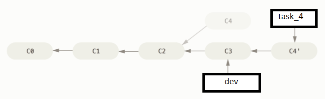

## Task

How to update current *task_4* branch with new commits from parent *dev* branch  that your work remains on top of it?

```
$ git rebase dev

```



explanation: essume, branch task_4 was branched from dev at commit C2. After that commit C3 was added to branch dev. with command _$ git rebase dev_  commit C3 will be merged BEFORE commits in task_4 branch.
